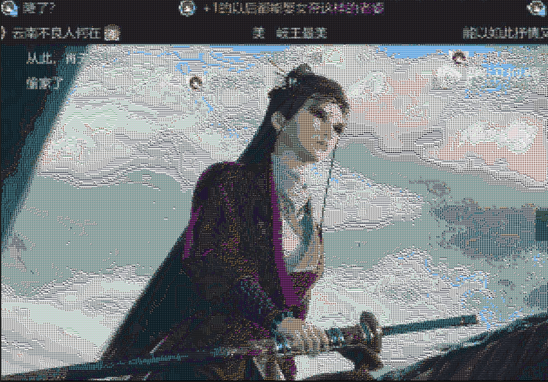

# Pixel Mosaic Generator--基于图像库的马赛克拼贴图片（像素风格艺术）

💡 提示：为了获得更精细、高质量的马赛克效果，建议先使用 [Upscayl](https://github.com/upscayl/upscayl) 对原始图片进行 AI 超分辨率放大。提升原图分辨率后，你在分割像素块时将拥有更大的操作空间，从而生成细节更丰富、过渡更自然的马赛克拼贴作品。

📌 简介

本工具可将任意输入图像转换为由自定义图像库构成的马赛克拼贴图。每个“像素”实际上是一张小图（如表情包、风景照、图标等），整体组合后形成宏观图像。

适用于：
艺术创作
个性化头像/海报生成
数据可视化趣味项目

🚀 推荐工作流

1. 准备原始图像
选择一张清晰、构图简洁的图片作为目标图像。

2. （可选但推荐）使用 Upscayl 提升分辨率
下载并安装 [Upscayl](https://github.com/upscayl/upscayl)
使用其内置的 AI 模型（如 Real-ESRGAN）将原图放大 2x–4x
输出高分辨率版本用于后续处理

3. 准备图像素材库
收集数百至数千张小图（建议统一尺寸，如 64×64 或 128×128），作为马赛克“色板”。

4. 运行马赛克生成器
将高分辨率原图与素材库输入程序，自动匹配颜色/纹理，生成最终拼贴图。

5. 导出与分享
保存为 PNG/JPG，或打印为大幅艺术海报！


📦 依赖与安装

```bash
pip install Pillow numpy scikit-learn opencv-python
```

🤝 致谢
[Upscayl](https://github.com/upscayl/upscayl) — 免费开源的 AI 图像清晰度增强工具，显著提升本项目生成质量


✨ 让每一像素都有故事 — 用成千上万张小图，拼出你眼中的世界。
